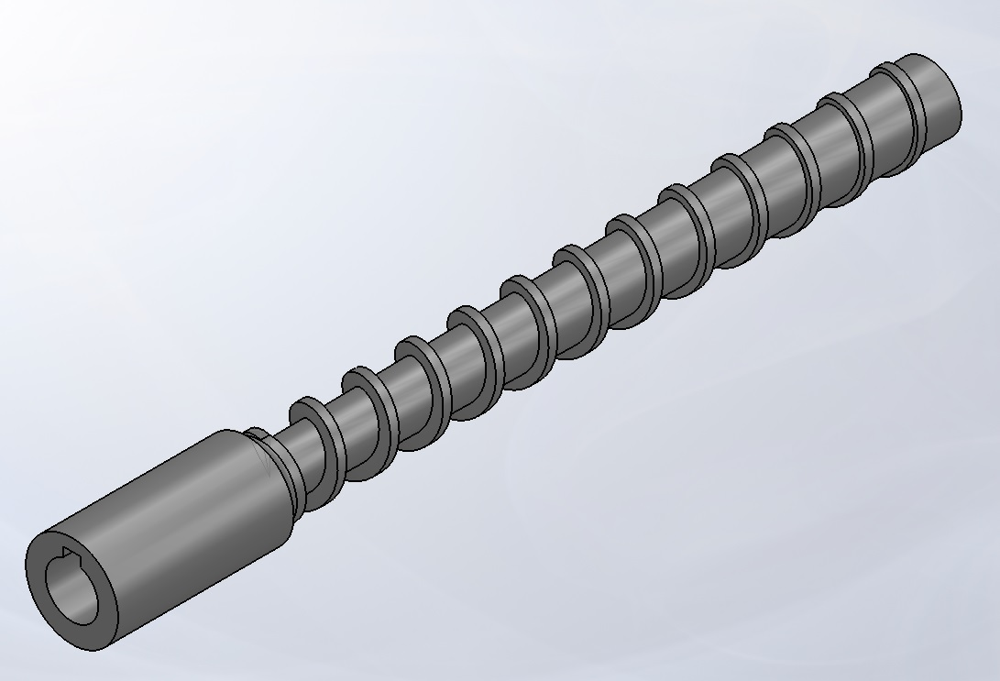
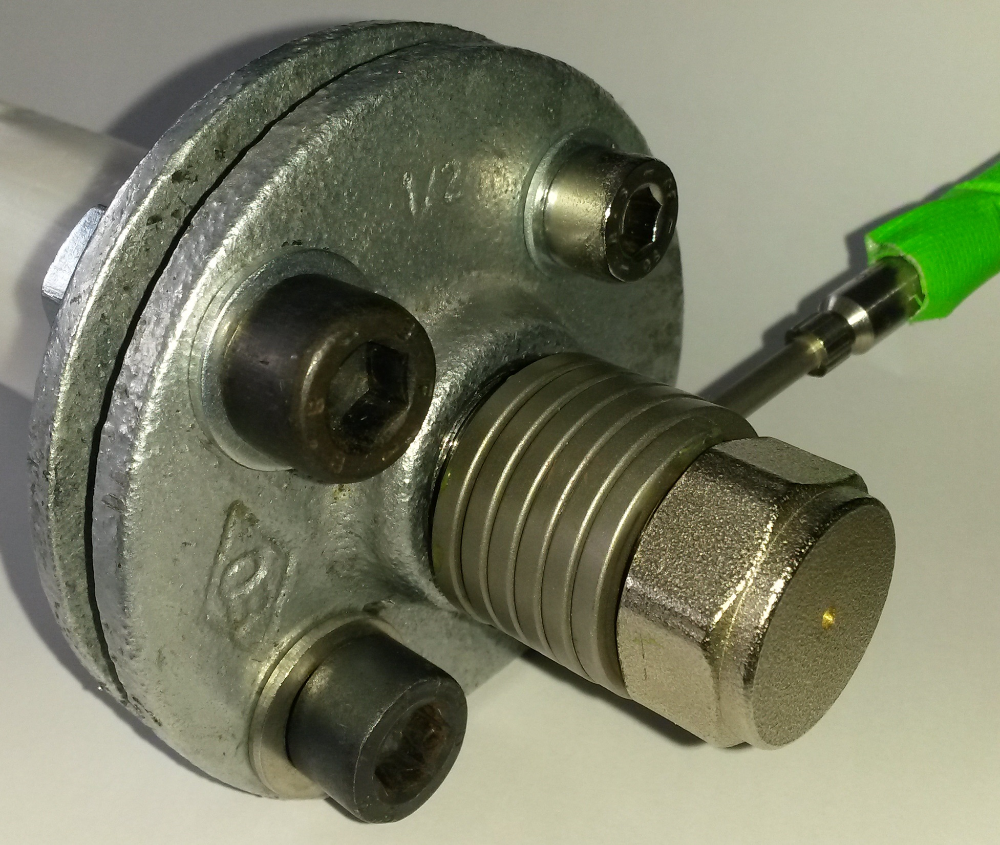
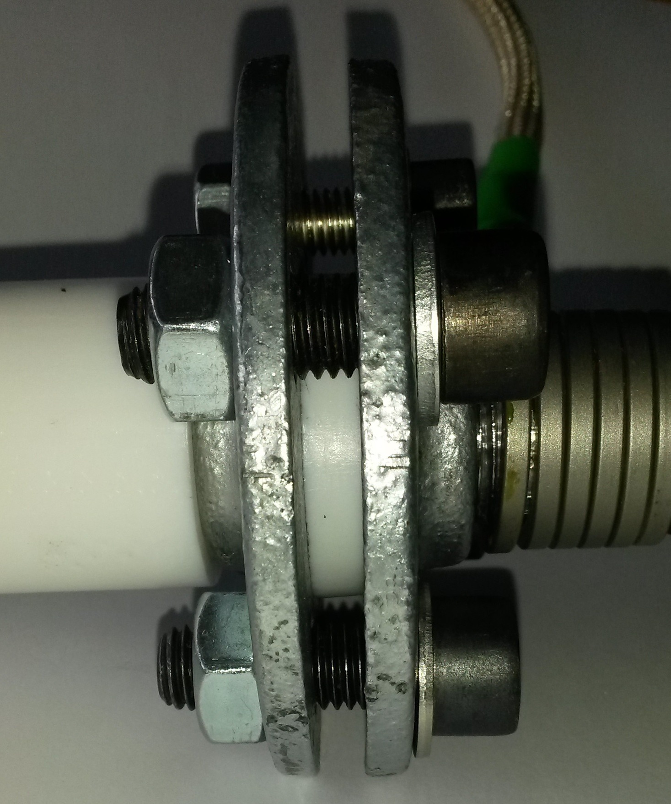

## More information about the parts of the extruder unit

+ The used extruder screw (custom part) with three zones:

+ The heating sleeve and the nozzle:

+ The thermal barrier to prevent the heating sleeve from from heating the hopper and melting the pellets before reaching the screw:
