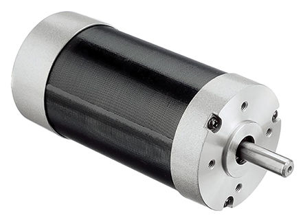
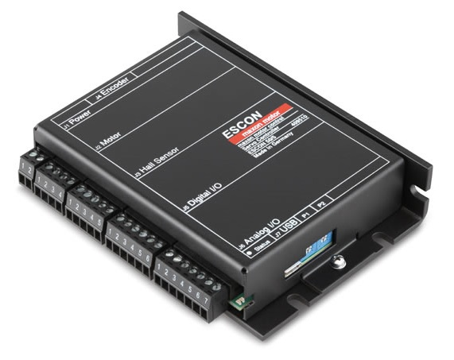
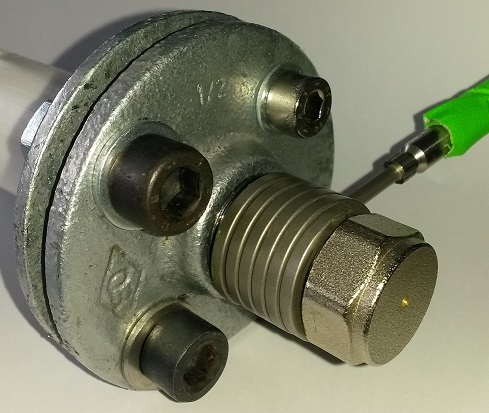
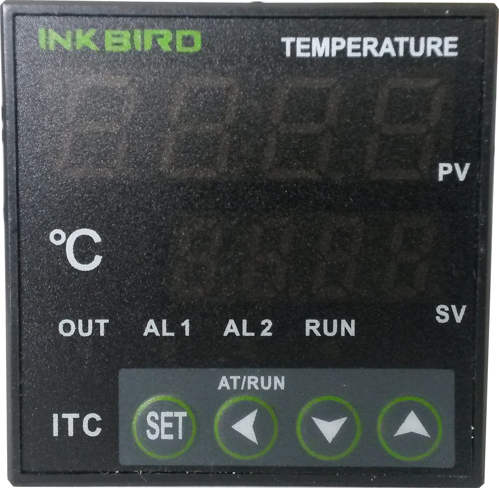
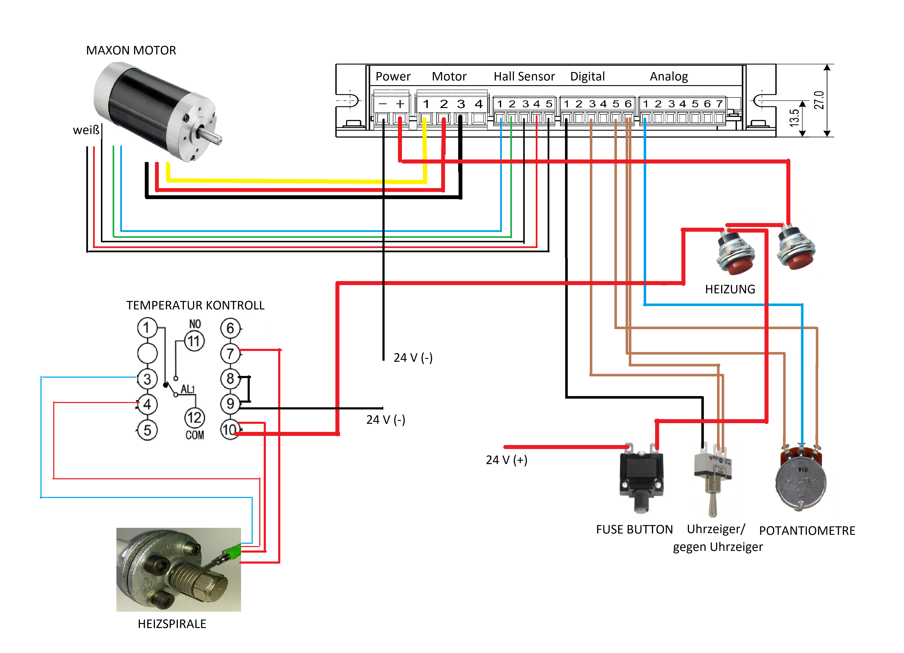
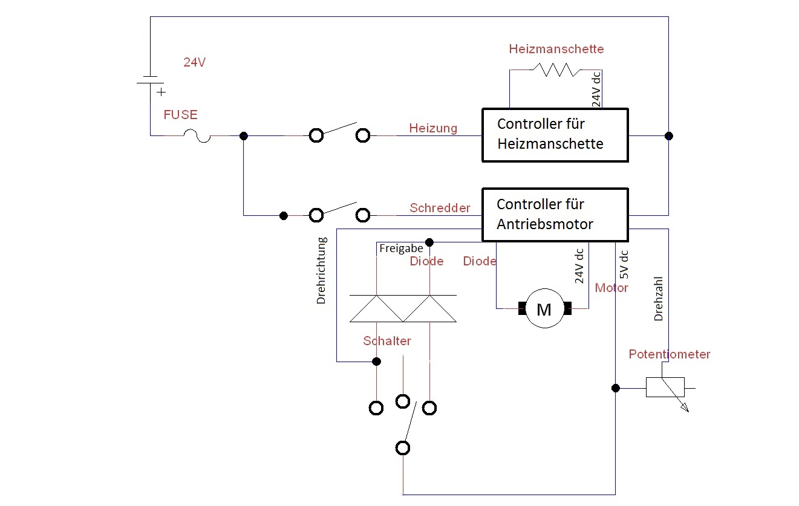

# Motor, heater and electronics
## Motor
  The Cubefactory 2 uses a dc motor called „RS Pro brushless dc motor". The new engine was selected based on calculations and general demands regarding mass and installation space.
  
???Thereby a minimum requirement of 0,88 Nm was determined fort he forque to punch and cut ABS and PLA plastics.
2.544 N/Min with rotary energy of 167W/2Nm without gearing mechanism
0,08 Nm with gearing mechanism???

Characteristic values:
+ voltage: 24 volt (dc)
+ current (norm.): 10 ampere
+ current (max.): 40 ampere
+ electrical power (norm.): 240 watt
+ torque (norm.): 0,44 newton metre
+ torque (max.): 1,76 newton metre
+ maximum speed: 3500 1/minute

## Planetary gear
  For the gear reduction of the powertrain a planetary gear (i=10:1) is used to lower the speed and reduce the shear strength of the synthetic material simultaneously. An experiment proofed that the shear strength of the two synthetic materials ABS and PLA sinks at a lower speed and therefore less cutting force for the shredding process of the synthetic material is required.

## Motor controller
  Brushless DC motors such as being built in this Recycler work on the functional principle of a three-phase synchronous motor. The engine is set in motion by excitation from permanent magnets. Besides, voltage is used to generate a rotary magnetic field in the stator and to drive the engine. Therefore the engine can be steered via voltage coming from a motor controller. This kind of controller switches the voltage to the single windings and varies the speed of the engine, in the simplest case depending on the DC voltage at the input.
 

 
Maxon Motor AG´s  ESCON 70/10 is used as engine controller. This controller enables the user to vary the motor speed by an analogous potentiometer or an external control voltage at a constant external direct voltage. It is also possible to fix minimal and maximum speed of the engine with a software and to stop the engine immediately. By using this function a safety key can be implemented with emergency stop.

## The heating sleeve

  The extrusion is heated up by an electric heating sleeve. It can be operated like the powertrain with 24 volts of DC voltage to avoid electric conversion losses and has a maximum power consumption of 150 watt. It can generate temperatures up to about 250°C. The inner diameter measures 21 mm and corresponds to the external diameter of the extruder tube. The heating cuff features a temperature sensor which ensures better temperature controlling.
  
## Temperature control

  The temperature setting and its supervision is carried out by a temperature controller from the company Inkbird called „D1S-2R-24“ which has an operating voltage of 24 volts DC. The target temperature can be adjusted and the actual temperature can be supervised by the display.

## Electric circuit
  For a better understanding oft the electric circuit two views can be used.
Whereas the first view shows the circuit oft the electronics, the second diagram supports the visual components for the motor controller. 

