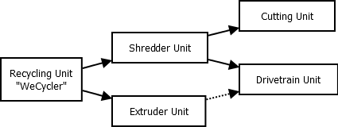
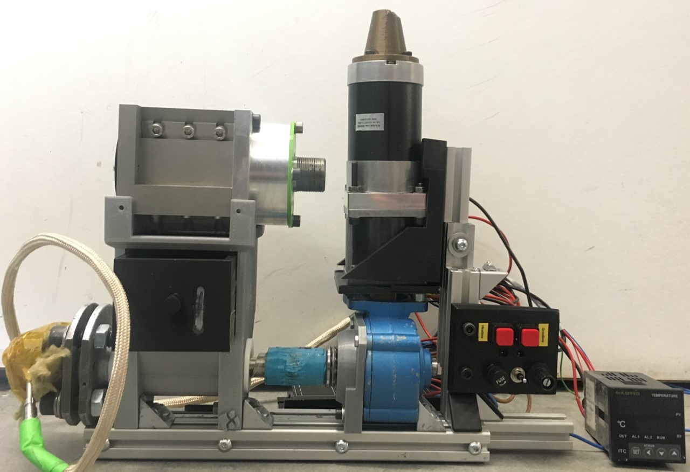
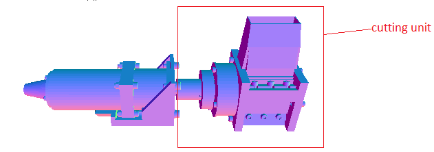
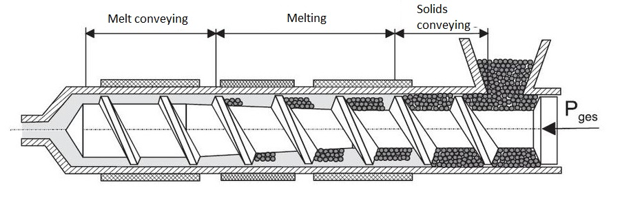
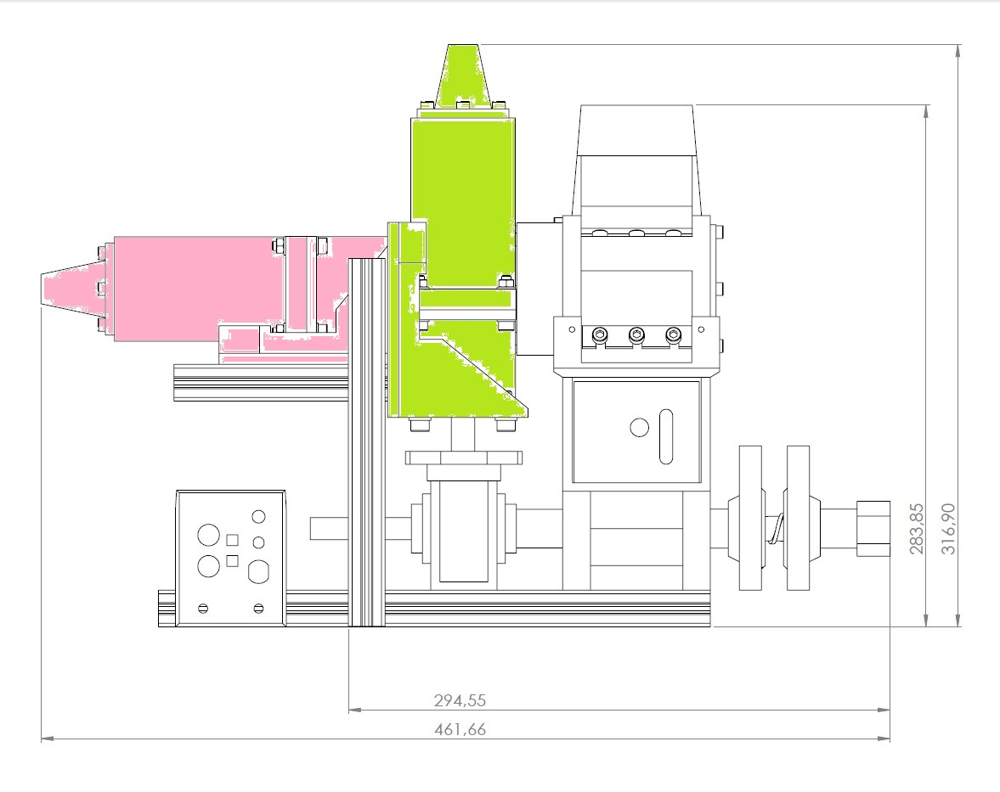

# Recycling unit
## Overview

 The recycling unit of the cubefactory 2 is able to produce filament for the 3d printer. In a two-step process plastic waste is shred into little pieces and then transformed into filament.

+ __input:__ waste from 3d printing or other plasic e.g. from plastic bags or plastic bottles (just a single type of material)

+ __output:__ filament that can be (spooled an then) used for FDM 3d printing 

+ two-step __process__ realized by two independent __modules__: 
	1. shredding the material into small pieces ([shredder](#Shredder)) 
	2. extruding the filament ([extruder](#Extruder))

+ the [powertrain](#Power) module can be attached to either the shredder or the extruder with the purpose of saving weight and costs

+ special requirements for the recycler to be used in the cubefactory 2:
	+ to be compact (small package)
	+ to be lightweight
	+ low power consuption 

+ hierarchy and drawing of the realized construction (3d view [here](CAD/CAD(stl)/00_00_00-wecycler.STL)):

 

## Shredder 
### Goals and concept
The Shredder aims to mechanically shred the input material into small, similar sized pieces.

+ __input:__ 
	+ different plastics (as long as they are sorted, clean and dry)
	+ possible sources could be misprints or PET bottles
+ __output:__
	+ smaller pieces (pellets)
	+ pieces should hopefully be equally sized (to later get a more consistent filament)
	+ maximum size can be limited via usage of filters
	
+ the selected __principle__ is a cutting mill with a stator and a rotor both equipped with static/ rotating blades 
+ the shredder should be __adaptable__ to process different materials and deliver variable pellet sizes
+ 

### Realization
+ 
+ the rotor is realized by a used (and damaged) milling cutter  (recycling!) 
+ the other parts are special components that have been manufactured for the WeCycler
+ To adapt to different materials, the speed (rpm) of the rotor is adjustable. Furthermore static blades can be moved to to change the distance between static and dynamic blades.
+ The output pellet size is determined by selection of a changeable filter (perforated plate)
+ more detailed information about the realized shredder [here](Shredder_Info.md)
 
## Extruder 
### Goals and concept
The extruder produces filament from pellets using pressure and heat.

+ __input:__ pellets or shredded material (equally small sized and just one type of material)
+ __output:__ filament
+  the extruder __process:__ [(explanation video)](https://www.youtube.com/watch?v=WaB-dsB1Kfk)

	1. feeding the material into a hopper
	2. the pellets are moved through a tube by a spinning screw
	3. the plasic melts due to the use heating elements along the tube an the pressure resulting from decreasing distance between screw and tube
	4. finally the meltet material is pressed trough a nozzle, forming a string of filament
	 
+ the extruder should be __adaptable__ to process different materials and pellet sizes. Also the diameter of the filament should be variable.
+  
(__TODO__ Bildquelle))

### Realization 
(__TODO__ Bildquelle, Beschriftung der Einzelteile?))

+ more detailed information on the single parts of the realized extruder unit [here](Extruder_Info.md)
 
## Powertrain 
+ For more information on the powertrain unit see [here](Powertrain_Info.md).
+ The powertrain can be attached in 2 different positions: either it drives the the shredder (pink) or the extruder (green). This is due to the need of saving money, space and weight.

+ 
### This Repository
+  exploded views [here](CAD/exploded_views)
+  BOM [here](BOM)
+  [CAD files](CAD)

### Links
https://www.3dhubs.com/talk/thread/which-shredding-and-extruding-machines-are-available-part-3

https://www.3dhubs.com/talk/thread/how-does-local-recycling-work-part-2
