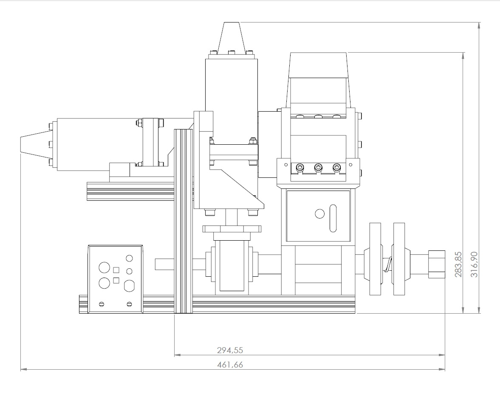
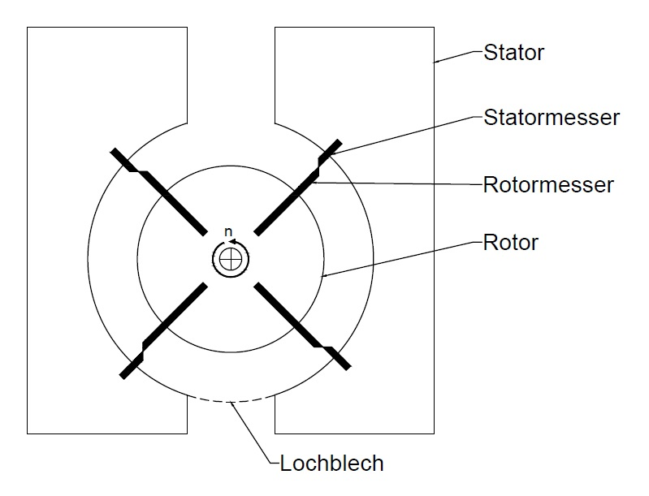
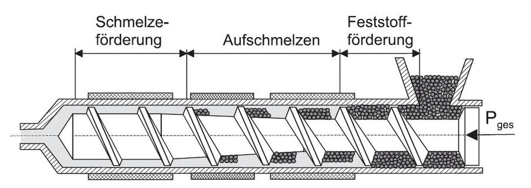
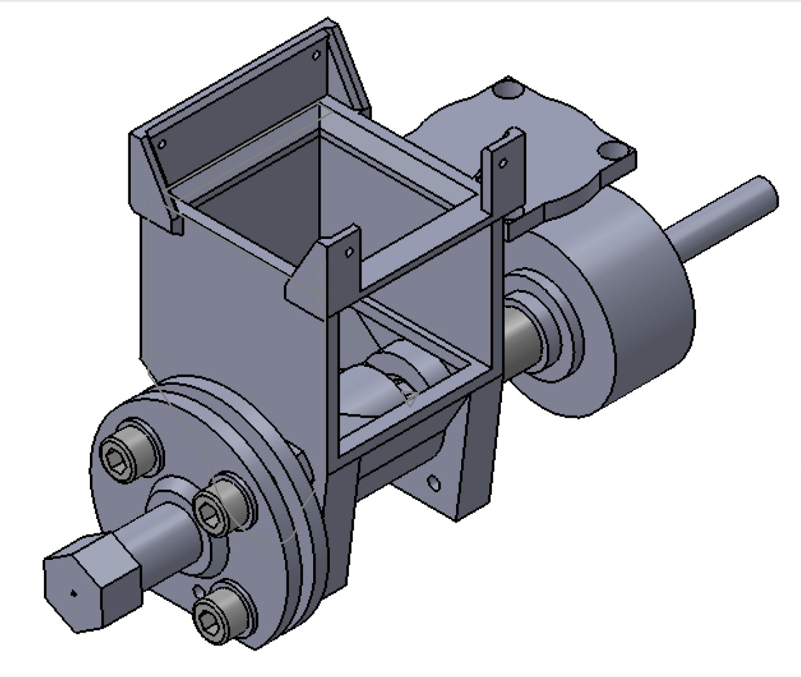

This ist the Readme for the Recycling Unit.
Work in Progress by karla.
 
-------------------------------------------
## Dieses Verzeichnis
+ hier kurze Einführung zum [Recycler] (#Recycling-Unit)
+ explodes views [here](images/exploded_view)
+ BOM [here](BOM)
+ [CAD files](CAD)

# Recycling Unit
[STL Link](CAD\WeCycler\Extrudergruppe\Extrudergruppe_STL\Baugruppe)

* The Recycling unit of the cubefactory consists in two independent modules
    * shredder 
    * extruder
* Ziel: "Kunststoffteile beziehungsweise -abfälle
insoweit zu verarbeiten, dass am Ende des zweistufigen Prozesses Filament für die
(erneute) Verwendung in 3D-Druckern zur Verfügung steht"
* "Ausgangsmaterial für das
Recycling kann dabei jede Art von thermoplastischem Kunststoff sein, der lokal zur
Verfügung steht. Denkbar sind als Ausgangsmaterial neben Fehldrucken aus
vorangegangenen 3D-Drucken auch andere Plastikabfälle wie PET-Flaschen oder
Plastiktüten"
* Zielprodukt: Filamentfaden als ausgangsmaterial für Weiterverarbeitung mit FDM 3d Drucker.
* Besondere Anforderungen für Cubefactory: "Herausforderung ist es, für den sehr begrenzten Bauraum in
der CubeFactory 2 eine kompakte Lösung zu finden, die es ermöglicht, bei geringem
Gewicht und geringem Stromverbrauch qualitativ gutes Filament zu erzeugen"

## Shredder
### Ziel und Prinzip
* mechanisches Zerkleinern von (sortenrein?) Material, Fehldrucke oder PET Flaschen
* es entstehen Pellets
* verschiedene Materialien möglich
* verschiedene Zielgrößen der Pellets möglich
* Konzept der Schneidmühle: (__TODO__ Bildquelle))  
### Der verbaute Shredder

## Extruder
### Das Prinzip Extruder

* Filament herstellen aus Pellets
* Extruder heißt ... Druck, Temperatur
* Pellets könnten auch einfach gekauft sein (billiger als gekauftes Filament)
* 3-Zonen-Extruderschnecke mit kernprogressivem Verlauf, Thermalbarriere
* 
(__TODO__ Bildquelle))

### Der verbaute Extruder 
Sieht so aus: (__TODO__ Bildquelle, Beschriftung der Einzelteile))

